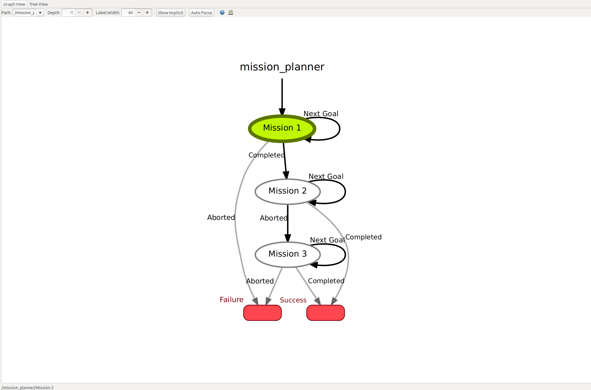

## General Info
This repo adds mission planning functionality to the stack.
Because it should be easy to get into the code and modify it, everything is kept compact and at a minimum level of abstraction.
The mission planner is based on the popular state machine library `smach`, but no prior knowledge is required.

Some terminology to start with:
In the context of this package, a waypoint denotes a named pose in the global frame.
A mission is a collection of tasks which are executed sequentially (e.g. a path through several waypoints).
A mission plan defines the logic how and when different missions are executed.
The mission plan is implemented as a `smach` state machine.
Each mission has its own mission data, containing relevant information for the mission (e.g. its waypoints).

The proposed workflow for mission planning is as follows:

1. Record mission data by using the `mission_recorder`
2. Create a plan for your missions in the `mission_plan`
3. Execute your missions by using the `mission_planner`

Each of these steps is explained in detail in the upcoming sections.


## Installation
(Could be added to the dependencies at a later stage.)

- Clone this repo into your workspace
- Install `smach_ros` from [here](http://wiki.ros.org/smach_ros) (a state machine library written in python with ROS support)
- Install `oyaml` with `pip install oyaml` (enables python2 compatibility with ordered dicts for `yaml` file dump)
- (Buid the package with `catkin build smb_mission_planner`)


## Record missions

### Basic Features
As it is fairly tedious to input poses manually for the mission waypoints, the `mission_recorder` helps you out.
It generates a `yaml` file with all the waypoint poses you recorded, grouped by mission.

You can launch it with
```
roslaunch smb_mission_planner mission_recorder.launch
```
which starts the node.
You can then give recording instructions with ros services.
To record a mission, call
```
rosservice call /record_mission {"mission_name","waypoint_1_name, waypoint_2_name, ..."}
```
where you can use your own `mission_name` and `waypoint_names`.
The number of waypoints can be selected arbitrarily, just add more to the list.
After you sent the `/record_mission` service, instructions will appear in the command window where you launched the node.
You can now input the waypoint poses of the current mission one by one.
This can be done

- in `rviz` by clicking `2D Nav Goal` and visually placing the pose on your map.
- by sending the desired pose in the topic `/move_base_simple/goal`.
- in `rviz` by sending a goal with the `smb_path_planner` widget.
- by calling the service `rosservice call /record_base_pose`, which will record the current base pose as a waypoint. Make sure that the odometry topic for the base pose is set correctly (see *Advanced Features* on how to do that).

After having recorded all your missions, stop the node with `Ctrl-C`.
All your recorded missions will be dumped to a `yaml` file (`my_config.yaml` per default).
Of course, you can also *manually edit* the generated `yaml` file to combine different recording sessions and to add or edit waypoints manually, etc.


### Advanced Features

#### Remove Missions
Remove missions while the node is running with:
```
rosservice call /remove_mission "mission_name"
```

#### Remove Waypoint
Remove waypoints in missions while the node is running with:
```
rosservice call /remove_waypoint {"mission_name","waypoint_name"}
```

#### Specify file for file dump
You can use a `roslaunch` argument to specify a filepath for the output file, e.g.
```
roslaunch smb_mission_planner mission_recorder.launch config_file_path:=/home/user_name/smb_2_0_catkin_ws/src/smb_mission_planner/configs/my_amazing_config.yaml
```

#### Prevent file dump
Prevent file dump with
```
rosservice call /toggle_file_dump "False"
```
or re-enable it with "True".


#### Choose your own input topic for recording
You can use a `roslaunch` argument to specify the waypoints' pose topic for the recording:
```
roslaunch smb_mission_planner mission_recorder.launch waypoint_topic_name:=/move_base_simple/goal
```

#### Choose your own odometry topic for recording
You can use a `roslaunch` argument to specify the base's pose topic for the recording:
```
roslaunch smb_mission_planner mission_recorder.launch base_pose_topic_name:=/base_pose_measured
```


## Mission planning

### Basic Features
You can combine your recorded missions to create a mission plan by connecting them to each other in the `mission_plan.py`.
The `mission_plan.py` should be modified by you to add more missions and connect them accordingly.
Here, a `smach` state machine is built up.
To learn more about it, visit the [tutorials](http://wiki.ros.org/smach/Tutorials).
Make sure to assign to each mission its respective mission data, i.e. its recorded information of the `yaml` file.

Currently, we provide you with a `DefaultMission` (see the file `mission_planner.py`), which implements the following:
	- Waypoints are set one by one, in the order they were defined in each mission in the `yaml` config file.
	- If the robot is unable to reach a waypoint for 60 seconds, it will skip it.
	- A waypoint is reached if the xy-position and the yaw-angle are within a certain tolerance.
	- If it cannot find the start of a mission, it will abort it.
To add a new mission type with your custom behaviour, see the next subsection below.

### Advanced features
Add your own mission types (e.g. to trigger a measurement instead of just reaching a waypoint):
	- Create a new mission class (similar to the `DefaultMission` in `mission_planner.py`).
	- Don't forget to inherit from `smach.State` and to implement the `__init__` and `execute` methods.
	- Add your new mission type to the `mission_plan.py` to use it.


## Executing your mission plan

### Basic features
The `mission_planner.py` executes the previously defined mission plan.

Start the simulation and the path planner.
As soon as the path planner is ready to receive goals, start the `mission_planner` with
```
roslaunch smb_mission_planner mission_planner.launch
```
The robot will now try to reach the specified waypoints of each mission one by one, as defined in the `yaml` file.
In the command line window of the `mission_planner` you can find information where and in which mission you currently are in.

### Advanced features

#### Enable visualization
You can enable the `smach` viewer to visualize your mission plan (i.e. a smach state machine) with a `roslaunch` argument:
```
roslaunch smb_mission_planner mission_planner.launch enable_viewer:=True
```
Make sure to select `/mission_planner` for the `Path:`-selection in the toolbar.
The visualizer is buggy at times (it does not seem to be properly maintained).

#### Specify mission data file
You can use a `roslaunch` argument to specify a filepath for the input file, e.g.
```
roslaunch smb_mission_planner mission_planner.launch config_file_path:=/home/user/smb_2_0_catkin_ws/src/smb_mission_planner/configs/my_amazing_config.yaml
```

#### Choose your own goal topic
You can use a `roslaunch` argument to specify the waypoints' pose topic:
```
roslaunch smb_mission_planner mission_planner.launch waypoint_topic_name:=/move_base_simple/goal
```

#### Choose your own odometry topic
You can use a `roslaunch` argument to specify the base's pose topic:
```
roslaunch smb_mission_planner mission_planner.launch base_pose_topic_name:=/base_pose_measured
```


## Example tutorial
In this simple example tutorial we will record and three short missions and create a mission plan for them.
When you clone the repo, everything is set up for this example, such that you can easily start by modifying it.

First we launch the `mission_recorder` with
```
roslaunch smb_mission_planner mission_recorder.launch
```
Next we start the recording of the first mission
```
rosservice call /record_mission {"check_fire_hazard","start, fire_place, end"}
```
and select the poses of the waypoints one by one (i.e. follow the instructions printed to the command line).
Launch rviz if you want to set them visually or see above for all possibilities of how to set them.

Next, we record two more missions: `gather_fruits` and `gather_vegetables` by repeating the same procedure as we did for the first mission.

After completing the recordings, we press `Ctrl-C` to stop the `mission_recorder` and to dump the recorded missions to the `my_config.yaml` file.
In the `example_config.yaml` you can find the recording we did beforehand as a reference.

Next, we create the `mission_plan` in `mission_plan.py`.
Here, we implement the following behaviour:
We start with `Mission 1`, `check_fire_hazard`. We then attempt to do `Mission 2`, `gather_fruits`.
In case `Mission 2` does not work, maybe because Cesar put a trash bin in the way, we use our backup mission, `Mission 3`, `gather_vegetables`.



Before executing the mission plan, make sure that the simulation and the path planner are running.
We then execute the `mission_plan` by launching the `mission_planner` with:
```
roslaunch smb_mission_planner mission_planner.launch
```
Currently, every mission is implemented as a `DefaultMission` (see section *Mission planning* from above), therefore the waypoints are set one by one for each mission in the order they were in the `yaml` file.
See the command line window of the mission planner for comprehensive information about what is happening.


## Where to go from here
- Try to record and execute a mission plan as shown in the example tutorial.
- Modify the mission plan in the `mission_plan.py` file, by adding e.g. more mission states of the `DefaultMission` to the state machine.
- Add your own mission types, e.g. to trigger a measurement instead of just reaching a waypoint.


## Common pitfalls
- It is easy to forget to change the mission names in the `mission_plan.py` when recording new missions.
- The rosservice argument must be of the form `{"mission_name","waypoint_1_name, waypoint_2_name, ..."}` without a space after the separating comma between the strings.
- If the `smach` viewer does not display anything, make sure to select `/mission_planner` for the `Path:`-selection in its toolbar.
- Make sure that your waypoints' pose topic and your base pose's topic are set correctly.
